#  SS13Lib

A drop in library for [Space Station 13](https://spacestation13.com) servers to integrate, allowing for authentication and discoverability on the SS13 Launcher, via the [SS13Hub](https://github.com/hry-gh/ss13hub) backend.

## Integration Guide

1. Copy the contents of `dmsrc/` into `ss13lib` in your `code/` directory.
2. Copy `ss13lib.dm` into a file of the same name, placed anywhere.
3. In your `.dme`, add `ss13lib.dm` as *early* as possible and `ss13lib.dme` as *late* as possible.
4. Carry out the configuration steps per `ss13lib.dm`, placing any external configuration *before* `ss13lib.dm` in your `.dme`.

### Minimal Implementation

```dm
//! In some file before ss13lib.dm, ie, ss13lib.config.dm:
#define SS13LIB_EXTERNAL_CONFIGURATION

#define SS13LIB_PLAYER_COUNT global.client_count
#define SS13LIB_SERVER_DISPLAY_NAME "My Awesome Server"
#define SS13LIB_SERVER_LANGUAGE "en" // en

#define SS13LIB_INFO_LOG(X) world.log << X
#define SS13LIB_WARNING_LOG(X) world.log << X
#define SS13LIB_ERROR_LOG(X) world.log << X

#define SS13LIB_GUESTS_BANNED FALSE

//! Anywhere else...
var/global/client_count = 0

/client/New(T)
	SS13LIB_CLIENT

	..()

	global.client_count++

/client/Del()
	..()

	global.client_count--

/world/Topic(T)
	SS13LIB_TOPIC

/world/IsBanned(key, address, computer_id, type)
	SS13LIB_ISBANNED
```

### Domain Attestation (Optional)

Domain attestation lets you prove ownership of a domain, showing a verified badge on the hub. This requires:

1. An ed25519 keypair
2. A DNS TXT record on your domain
3. A rustg (or equivalent) ed25519 signing function and unix timestamp function

#### Generate keypair

```bash
# Generate an ed25519 private key
openssl genpkey -algorithm ed25519 -out privkey.pem

# Extract the raw 32-byte seed, base64-encoded — this is your SS13LIB_ATTEST_PRIVKEY
openssl pkey -in privkey.pem -outform DER | tail -c 32 | base64

# Extract the raw 32-byte public key, base64-encoded — this goes in your DNS record
openssl pkey -in privkey.pem -pubout -outform DER | tail -c 32 | base64
```

#### Set DNS record

Add a TXT record at `_ss13hub.<your domain>` with the public key from above:

```
_ss13hub.play.example.com.  TXT  "ss13hub-ed25519=<base64 public key>"
```

#### Configure SS13Lib

```dm
#define SS13LIB_ATTEST_DOMAIN "play.example.com" // max 32 characters
#define SS13LIB_ATTEST_PRIVKEY "<base64 private seed from above>" // this is a secret, put this in your config!
#define SS13LIB_ED25519_SIGN(privkey, message) rustg_ed25519_sign(privkey, message)
#define SS13LIB_UNIX_EPOCH rustg_unix_timestamp()
```

On each server start, SS13Lib will sign a challenge from the hub and submit it. If verification succeeds, your server appears with a verified domain in the listing.

## Flows

```mermaid
sequenceDiagram
    participant Game as Game Server
    participant Hub as Hub Server
    participant Launcher as SS13 Launcher

    rect rgb(40, 40, 80)
    Note over Game, Hub: Handshake
    Game->>Hub: GET /handshake (lib version + port)
    Hub-->>Game: server_id
    Note over Game: Stores server_id, begins heartbeat loop
    end

    rect rgb(40, 80, 40)
    Note over Game, Hub: Heartbeat (recurring)
    Game->>Hub: GET /heartbeat (port)
    Note over Hub: Adds server to list for next polling cycle
    Hub->>Game: world/Topic query (SS13LIB_QUERY_CODE)
    Game-->>Hub: JSON response (pop, display_name, language, round info, ...)
    end

    rect rgb(80, 40, 40)
    Note over Game, Launcher: Authentication
    Launcher->>Hub: Request auth ticket (ip + port)
    Hub-->>Launcher: auth_ticket (scoped to ip + port)
    Launcher->>Game: Connect with auth_ticket as connection param
    Game->>Hub: POST /authenticate (auth_ticket + server_id)
    Hub-->>Game: ckey_to_use + username
    Note over Game: Sets client.ckey, resumes /client/New()
    end
```



## TODOs
- Create restart flow (requires /world/Reboot() hook, post parent call in client/Login() hook)
- Always connect control server, store connection details here instead of in the library
- Better versioning(?)
