#  SS13Lib

A drop in library for [Space Station 13](https://spacestation13.com) servers to integrate, allowing for authentication and discoverability on the SS13 Launcher, via the SS13Hub backend.

## Integration Guide

1. Copy the contents of dmsrc into `ss13lib` in your `code/` directory.
2. Copy ss13lib.dm into a file of the same name, placed anywhere.
3. In your .dme, add ss13lib.dm as *early* as possible and ss13lib.dme as *late* as possible.
4. Carry out the configuration steps per ss13lib.dm, placing any external configuration *before* ss13lib.dm in your .dme.

## Flows

```mermaid
sequenceDiagram
    participant Game as Game Server
    participant Hub as Hub Server
    participant Launcher as SS13 Launcher

    rect rgb(40, 40, 80)
    Note over Game, Hub: Handshake
    Game->>Hub: GET /handshake (lib version + port)
    Hub-->>Game: server_id
    Note over Game: Stores server_id, begins heartbeat loop
    end

    rect rgb(40, 80, 40)
    Note over Game, Hub: Heartbeat (recurring)
    Game->>Hub: GET /heartbeat (port)
    Note over Hub: Adds server to list for next polling cycle
    Hub->>Game: world/Topic query (SS13LIB_QUERY_CODE)
    Game-->>Hub: JSON response (pop, display_name, language, round info, ...)
    end

    rect rgb(80, 40, 40)
    Note over Game, Launcher: Authentication
    Launcher->>Hub: Request auth ticket (ip + port)
    Hub-->>Launcher: auth_ticket (scoped to ip + port)
    Launcher->>Game: Connect with auth_ticket as connection param
    Game->>Hub: POST /authenticate (auth_ticket + server_id)
    Hub-->>Game: ckey_to_use + username
    Note over Game: Sets client.ckey, resumes /client/New()
    end
```

## TODOs
- Shore up schema for:
	- handshake
	- authentication
	- topic
- Trial integrations into actual codebases
